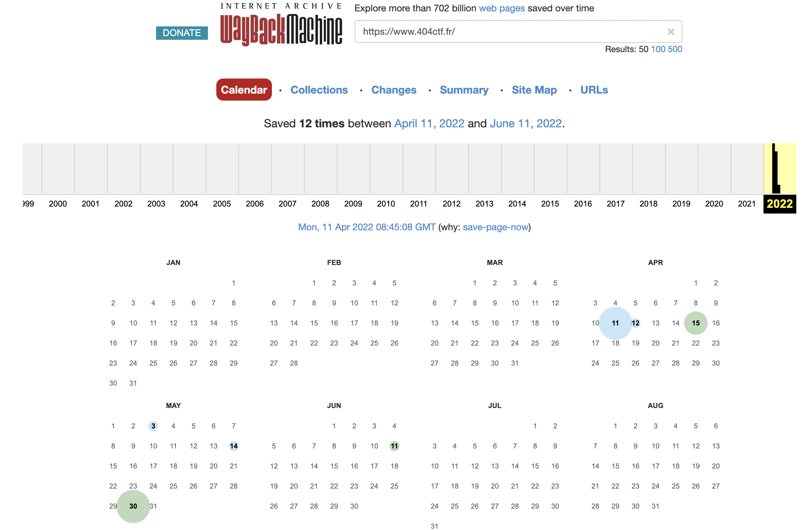
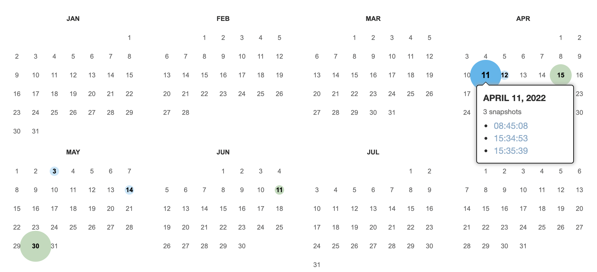
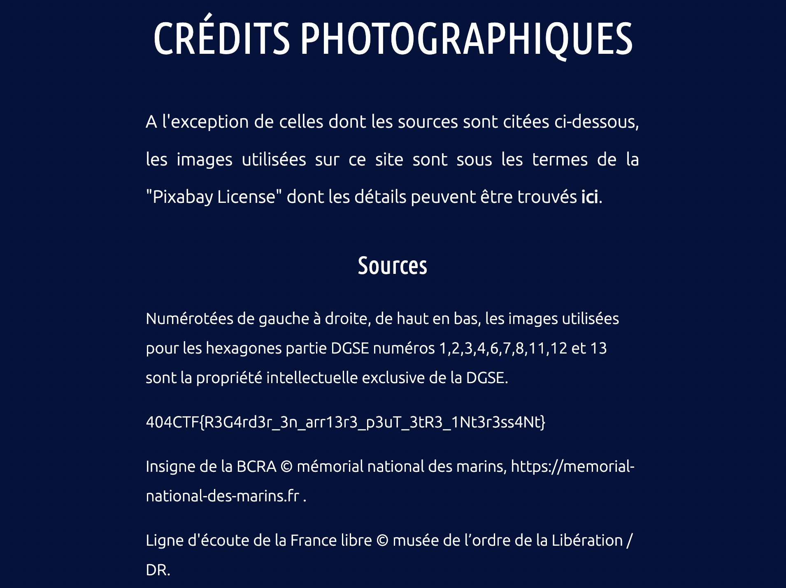

**OSINT** - Collaborateur suspect

---

# Context
Apparently, the [homepage](https://www.404ctf.fr/) of the CTF has been used by **Hallebarde** to broadcast sensitive information.
It has been briefly modified to do so.

# Challenge

## Idea
Our goal is too retrieve information that has been publicly accessible during a short time on the website hosting the CTF ([https://www.404ctf.fr/](https://www.404ctf.fr/)). So we can try to use [WayBack Machine](https://web.archive.org/) to see the different snapshots taken for this website.

## WayBack Machine
[Research URL](https://web.archive.org/web/*/https://www.404ctf.fr/-)

When I write this, there are 12 snapshots. But back during the CTF there where (at least) one less.

What we are looking at here is two consecutive snapshots that have been taken relatively close to each other.

For example, on the April 11th, two snapshots have been taken respectively at 15:34:53 and 15:35:39. we can try by this pair, and thus looking at the [15:34:53 snapshot](https://web.archive.org/web/20220411153453/https://www.404ctf.fr/).

On the reception page, nothing is different from the one we know, so I decided to look at other pages we could access from this one, and I found the [Crédits photographiques](https://web.archive.org/web/20220411084948/https://www.404ctf.fr/credit.html) one.

And bingo! There is indeed something different here, being the flag of the challenge.

# The flag
`404CTF{R3G4rd3r_3n_arr13r3_p3uT_3tR3_1Nt3r3ss4Nt}`

